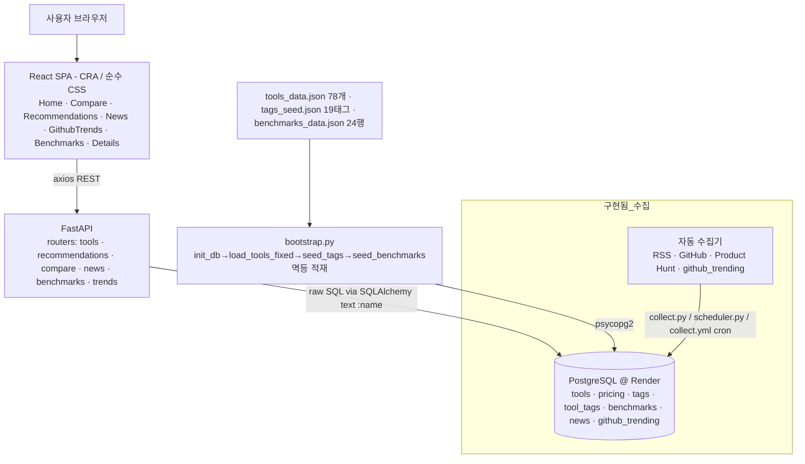
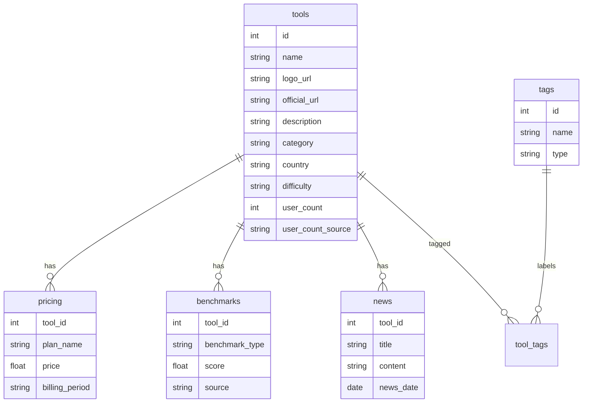
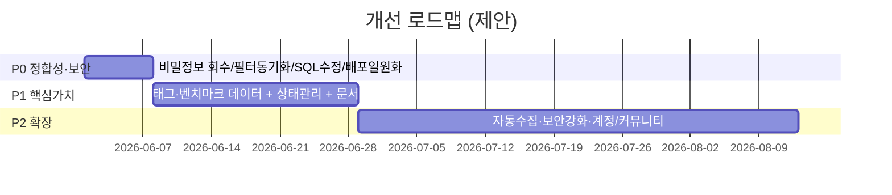

# AI Tools Platform — 프로젝트 개요 및 기획 점검

> 작성일: 2026-05-30 · 점검자: 기획 리서처
> 대상 커밋: `adccee8` (claude/happy-poincare-559f3a 브랜치 기준)
> 점검 범위: 코드베이스(`backend/`, `frontend/`) + 기존 기획 문서(`README.md`, `ARCHITECTURE.md`, `DATA_COLLECTION_PLAN.md`, `API_*.md`)

---

## TL;DR

- **무엇인가**: "AITools" — AI 도구를 탐색·비교·추천받는 풀스택 웹 플랫폼. FastAPI(백엔드) + React(프론트엔드) + PostgreSQL.
- **현재 상태**: 골격은 모두 구현됨. 도구 목록/상세/비교 동작. **추천·벤치마크는 데이터 점등 완료**(태그 19개·`tool_tags`≈312행 매핑, 벤치마크 24행 적재). **뉴스·깃헙트렌드는 수집 파이프라인 완비**(초기 0행 시작, cron 수집 실행 시 점등). 자동 트렌드 수집은 더 이상 미구현이 아니라 **구현 완료(스케줄러 기본 비활성, GitHub Actions cron으로 구동)**.
- **가장 큰 갭(해소 이력)**: 과거 핵심 갭이던 (1) 추천·벤치마크 데이터 부재 → **해소(seed 스크립트 적재)**, (2) SQL 파라미터 바인딩 혼재(`%(name)s`/`:name`) → **해소(전부 `:name` 통일)**, (3) 하드코딩 시크릿 커밋 → **해소(환경변수화)**. 잔존 갭은 프론트 필터 카테고리 동기화(G5)와 운영 DB 부트스트랩 라이브 확인(미확정).
- **문서 vs 코드 불일치**: 기획 문서는 Tailwind·TypeScript·Vite를 명시하나, 실제 코드는 CRA(Create React App)·순수 CSS·React 19·JS다(정정 대상). 자동수집은 이제 구현됨(`backend/collectors/*`, `collect.py`, `scheduler.py`, `.github/workflows/collect.yml`). 배포 토폴로지는 확정됨 — **백엔드 Railway · DB Render · 프론트 Vercel**.
- **권고**: 기능 확장보다 먼저 (1) 데이터 정합성(카테고리/태그/벤치마크), (2) 보안(비밀정보 회수), (3) 문서-코드 일치화를 우선 정리할 것.

---

## 1. 프로젝트 개요

| 항목 | 내용 | 근거 |
|------|------|------|
| 제품명 | AITools — AI 도구 비교 플랫폼 | `README.md:1`, `backend/app/main.py:14` |
| 한 줄 정의 | "AI 도구들을 벤치마크로 비교하고, 트렌드를 자동 수집하고, 맞춤 추천받는 플랫폼" | `README.md:7` |
| 형태 | 풀스택 웹 (REST API + SPA) | `ARCHITECTURE.md:20-85` |
| 버전 | 1.0.0 | `backend/app/main.py:16`, `README.md:4` |
| 언어 | 한국어 UI / 한국어 데이터 | `frontend/src/App.js:34-44`, `backend/tools_data.json` |

---

## 2. 비전 · 주제

기획 문서가 명시하는 제품 비전은 다음 4개 축으로 요약된다 (`README.md:21-47`):

1. **탐색·검색** — 78개+ AI 도구 DB, 카테고리/가격/난이도/사용자수 필터, 실시간 검색
2. **성능 기반 비교** — 2~5개 도구를 나란히 비교, 가격·사용자수·벤치마크 점수
3. **맞춤 추천** — 업무별/직업별 추천, 로그인 없이 즉시 사용
4. **자동 트렌드 수집** — Product Hunt·GitHub·웹 크롤링·RSS로 도구 정보와 뉴스를 주 1회 자동 갱신 (`DATA_COLLECTION_PLAN.md:22-35`)

> **핵심 차별점(기획 의도)**: 단순 도구 디렉토리가 아니라 **"벤치마크 점수 기반 비교"**와 **"자동 수집되는 최신성"**이 가치 제안의 중심. (벤치마크는 점등 완료(24행/LLM 9개), 자동수집은 구현 완료 — 뉴스·깃헙트렌드는 0행 시작이라 cron 수집 실행 시 점등)

---

## 3. 타겟 사용자 (추론)

명시적 페르소나 문서는 없음. 기능 구조(업무별/직업별 추천 옵션)에서 역산한 타겟 — **추론**:

| 세그먼트 | 근거 | 신뢰도 |
|----------|------|--------|
| 직군별 실무자 (개발자·디자이너·마케터·콘텐츠크리에이터·데이터분석가) | `frontend/src/pages/Recommendations.jsx:14` | 합리적 추론 |
| 업무 기반 탐색자 (콘텐츠작성·이미지생성·영상생성·데이터분석·코딩) | `frontend/src/pages/Recommendations.jsx:13` | 합리적 추론 |
| "어떤 AI 도구를 써야 할지 모르는" 초기 탐색 사용자 | 난이도 필터·추천 기능 존재 | 합리적 추론 |

가치 제안(추론): *"수많은 AI 도구 중 내 직무·업무에 맞는 것을, 객관적 지표로 비교해 빠르게 고른다."*

---

## 4. 핵심 기능 (구현된 API 기준)

백엔드는 5개 라우터를 등록 (`backend/app/main.py:32-36`):

| 기능 | 엔드포인트 | 구현 파일 | 상태 |
|------|-----------|-----------|------|
| 도구 목록 (필터·정렬·페이징·검색) | `GET /api/tools` | `routers/tools.py:10` | 구현됨 (단, 파라미터 바인딩 이슈 — 7장 참조) |
| 도구 상세 (벤치마크·가격·뉴스 포함) | `GET /api/tools/{id}` | `routers/tools.py:122` | 구현됨 (벤치마크 점등, 뉴스는 수집 전까지 빈 배열) |
| 맞춤 추천 (업무/직업) | `GET /api/recommendations` | `routers/recommendations.py:9` | 구현됨 + **데이터 점등(seeded)** — 태그 19개·`tool_tags`≈312행 (`seed_tags.py`) |
| 도구 비교 (1~5개) | `GET /api/compare` | `routers/compare.py:9` | 구현됨 |
| 벤치마크 조회/요약/타입 | `GET /api/benchmarks*` | `routers/benchmarks.py` | 구현됨 + **데이터 점등(seeded)** — 24행/LLM 9개 (`seed_benchmarks.py`) |
| 뉴스/트렌딩 | `GET /api/news*` | `routers/news.py` | 구현됨 + **수집 대기**(파이프라인 완비, 0행 시작 → cron 수집 시 점등). 빈 데이터는 `success:true`+빈 배열 graceful |
| 깃헙 트렌드 | `GET /api/trends/github` | `routers/trends.py` + `collectors/github_trending.py` | 구현됨(수집기·테마 매핑·라우터). 데이터는 수집 실행 후 점등(`github_trending` 테이블 선적용 필요) |
| 헬스/루트 | `GET /health`, `GET /` | `main.py:39-68` | 구현됨 |

프론트엔드 페이지 (`frontend/src/App.js:50-55`):

7화면 구현 완료:

| 라우트 | 페이지 | 파일 |
|--------|--------|------|
| `/` | 홈 (Hero + 검색 디바운스 + 필터 + 도구 그리드, 트렌드 중심 가치 카피·보조 CTA) | `pages/Home.jsx` |
| `/compare` | 비교 | `pages/Compare.jsx` |
| `/recommendations` | 추천 | `pages/Recommendations.jsx` |
| `/news` | 뉴스 | `pages/News.jsx` |
| `/trends/github` | 깃헙 트렌드 | `pages/*` (trends/github) |
| `/benchmarks` | 벤치마크 | `pages/*` |
| `/details/:id` | 도구 상세 | `pages/Details.jsx` |

공용 컴포넌트(신규): `components/GlobalSearch.jsx`(헤더 타입어헤드, 300ms 디바운스, `searchTools` limit 6, 항목→`/details/:id`, Enter→`/?search=q`), `components/CompareTray.jsx`(`useUIStore` 자립 구독 공용 비교 트레이, Home·Recommendations 사용). `App.js` 네비/푸터 순서 재배치(홈→추천→비교(뱃지)→트렌드▾→벤치마크).

---

## 5. 기술 스택 (문서 vs 실제)

문서와 실제 구현이 여러 곳에서 어긋난다. **실제 코드가 사실(fact)이며, 문서는 의도/구버전 기록으로 본다.**

| 영역 | 기획 문서 주장 | 실제 코드 | 근거 |
|------|---------------|-----------|------|
| 백엔드 프레임워크 | FastAPI | FastAPI ✅ | `requirements.txt:1`, `main.py:13` |
| 백엔드 호스팅 | Render (`README.md:153`) / Railway (커밋 메시지) | 양쪽 설정 공존 (`render.yaml`, `Dockerfile` "Railway", `Procfile` gunicorn) | `backend/render.yaml`, `Dockerfile:5`, `backend/Procfile` |
| 프론트 프레임워크 | React 18 | **React 19.2** | `frontend/package.json:11` |
| 빌드 도구 | Vite (`ARCHITECTURE.md:285`) | **react-scripts (CRA)** | `frontend/package.json:14,19` |
| 언어 | TypeScript (`ARCHITECTURE.md:280`) | **JavaScript (.js/.jsx)** | `frontend/src/*` |
| 스타일링 | Tailwind CSS | **순수 CSS** (`styles/*.css`) | `frontend/src/styles/`, package.json에 tailwind 없음 |
| 상태관리 | Zustand | Zustand 설치됨 — 단 Home/Recommendations는 **로컬 useState** 사용 | `package.json:16`, `pages/Home.jsx:7-12` vs `stores/toolStore.js` |
| ORM | SQLAlchemy | SQLAlchemy(엔진/세션만), 모델 없이 **raw SQL** | `database.py`, `routers/*.py`의 `text()` |
| DB | PostgreSQL 15 | PostgreSQL (Render 호스팅) ✅ | `backend/load_tools_fixed.py:13` |
| 데이터 수집 | APScheduler 자동수집 | **구현됨** — `collectors/*` + `collect.py` + `scheduler.py`(APScheduler 기본 비활성) + `.github/workflows/collect.yml`(cron) | `backend/collectors/*`, `collect.py`, `scheduler.py`, `.github/workflows/collect.yml` |

> **주의**: `README.md`는 백엔드 구조를 `models/`, `schemas/`, `services/`, `config.py`로 묘사(`ARCHITECTURE.md:119-143`)하지만 실제 `backend/app/`에는 해당 폴더가 없다. 실제 구조는 `main.py / database.py / auth.py / exceptions.py / routers/`로 더 단순하다.

---

## 6. 아키텍처 (실제 구현 기준)

데이터 모델 (DB 스키마 — 라우터 쿼리에서 역산):

> `tags.type`은 `'task'` 또는 `'profession'` 값을 가짐 (`routers/recommendations.py:27,51`). 추천은 `tool_tags` 조인에 의존한다.

---

## 7. 현재 구현 현황 (데이터 관점)

시드 데이터(코드 정본) 기준 현황:

- **도구 78개** 적재됨(`backend/tools_data.json`). 보유 필드: `name, logo_url, official_url, description, category, country, difficulty, user_count, user_count_source, pricing`.
- **태그 점등**: `backend/tags_seed.json`(19 태그 — task 11 · profession 8) + `seed_tags.py`가 78개 도구에 매핑 → `tool_tags`≈312행. (과거 "tags 데이터가 JSON에 없음" 서술은 정정 — 별도 `tags_seed.json`으로 존재)
- **벤치마크 점등**: `backend/benchmarks_data.json`(24행, LLM 9개: ChatGPT/Claude/Gemini/Copilot/Llama2/Mistral/Falcon/Vicuna/Cohere) + `seed_benchmarks.py`. (과거 "benchmarks 0건" 서술 정정)
- **뉴스·깃헙트렌드**: 시드 0행 시작. 수집 파이프라인(`collectors/{base,rss,github,producthunt,github_trending}.py`, `collect.py`, `scheduler.py`)으로 점등. `.github/workflows/collect.yml`이 매일 `0 0 * * *` cron 실행. `collect.py --backfill-translations`로 `title_ko`/`description_ko` 무료(MyMemory) 백필.
- **부트스트랩**: `backend/bootstrap.py`가 `init_db.py`(schema.sql)→`load_tools_fixed.py`→`seed_tags.py`→`seed_benchmarks.py` 순으로 멱등 적재. 검증 SQL 기대치: tools=78, pricing>0, tags=19, tool_tags=312, benchmarks=24, news=0, github_trending=0.
- 실제 DB 카테고리 분포 (JSON 기준):

| 카테고리 | 개수 | 카테고리 | 개수 |
|----------|------|----------|------|
| 개발도구 | 22 | 생성형AI | 13 |
| AI플랫폼 | 10 | 생산성 | 4 |
| 이미지생성 | 3 | 콘텐츠생성 | 3 |
| 데이터분석 | 3 | 비디오생성 | 2 |
| (그 외 12개 카테고리) | 1~2 | | |

---

## 8. 갭 분석 (기획 의도 vs 실제 구현)

### 8.1 기능 갭 (치명적)

| # | 갭 | 영향 | 근거 |
|---|-----|------|------|
| G1 | **[해소]** 추천 기능 데이터 점등 — 과거 `tags`/`tool_tags` 미적재로 빈 결과였으나, `tags_seed.json`(19) + `seed_tags.py`로 `tool_tags`≈312행 매핑 완료. 업무/직업 추천 동작. | 핵심 기능 복원 | `recommendations.py:22-66`, `tags_seed.json`, `seed_tags.py` |
| G2 | **[해소]** 벤치마크 데이터 시드 — `benchmarks_data.json`(24행/LLM 9개) + `seed_benchmarks.py` 적재. 비교·상세 화면 실데이터화. | 차별화 가치 실현(초기 LLM 한정) | `benchmarks_data.json`, `seed_benchmarks.py` |
| G3 | **[해소]** 자동 수집 구현 — `collectors/{base,rss,github,producthunt,github_trending}.py` + `collect.py` + `scheduler.py`(APScheduler, 기본 비활성) + `.github/workflows/collect.yml`(매일 `0 0 * * *`). | 최신성 가치 구현(수집 실행 시 점등) | `backend/collectors/*`, `collect.py`, `.github/workflows/collect.yml` |
| G4 | **[수집대기]** 뉴스 데이터 — 파이프라인 완비, 시드 0행. cron 수집 시 점등. 빈 상태는 graceful(`success:true`+빈 배열). | 수집 1회 실행 전까지 빈 화면 | `routers/news.py`, `collect.py`, `collectors/rss.py` |

### 8.2 정합성 / 버그 갭

| # | 갭 | 영향 | 근거 |
|---|-----|------|------|
| G5 | **프론트 필터 카테고리 불일치** — Home은 `['이미지생성','영상생성','텍스트생성','데이터분석','코딩']`을 필터로 노출하지만, 실제 DB 주력 카테고리는 `생성형AI/개발도구/AI플랫폼`. 특히 `영상생성`·`텍스트생성`·`코딩`은 DB에 존재하지 않아 **선택 시 0건**. | 사용자가 필터링하면 대부분 빈 화면 | `pages/Home.jsx:14` vs 7장 카테고리 분포 |
| G6 | **추천 옵션값 불일치** — 추천 업무 `['콘텐츠작성','영상생성','코딩'...]`이 태그 데이터와 매칭될 보장 없음(애초에 태그 부재). | 추천 0건 | `Recommendations.jsx:13-14` |
| G7 | **[해소]** SQL 파라미터 바인딩 통일 — 과거 `tools.py`·`recommendations.py`의 `%(name)s` psycopg2 스타일과 `:name`이 혼재했으나, 전 라우터를 SQLAlchemy `text()` `:name` 바인딩으로 통일. | 필터·검색·추천 정상화 | 전 `routers/*.py` `:name` 바인딩 |
| G8 | **상태관리 이원화** — `stores/toolStore.js`(Zustand)가 있지만 Home·Recommendations는 로컬 useState로 중복 구현. 비교 선택 로직(`useUIStore`)도 페이지와 미연결로 보임. | 유지보수성 저하, 데드코드 | `Home.jsx:7-12`, `toolStore.js:5-93` |

### 8.3 문서 / 운영 갭

| # | 갭 | 영향 | 근거 |
|---|-----|------|------|
| G9 | **[해소]** 비밀정보 커밋 — 하드코딩 API 키·평문 DB 비밀번호 제거, 환경변수만 사용하도록 정리. | 자격증명 유출 위험 제거 | `auth.py`, `load_tools_fixed.py` (환경변수화) |
| G10 | **[해소]** CORS — 와일드카드 제거. `ALLOWED_ORIGINS` 화이트리스트 + `allow_credentials=False`로 변경. | 보안 모범사례 준수 | `main.py` (`ALLOWED_ORIGINS`) |
| G11 | **호스팅 정의 혼재** — Render(`render.yaml`)·Railway(`Dockerfile`)·gunicorn(`Procfile`) 공존. `Procfile`은 `gunicorn app.main:app`인데 ASGI 앱에 uvicorn worker 미지정 → 그대로면 기동 실패 가능. | 배포 혼선 | `render.yaml`, `Dockerfile:5`, `Procfile` |
| G12 | **[해소]** 문서-코드 불일치 정정 — README/ARCHITECTURE의 TS/Tailwind/Vite/구버전 구조 주장을 실제 스택(React 19/CRA/순수 CSS/raw SQL)으로 동기화 완료. | 신규 합류자 혼란 해소 | 5장 표, README/ARCHITECTURE 갱신본 |
| G13 | **[부분해소]** 레이트리밋 실제 적용 — 인메모리 방식으로 라우터에 연결됨. 단 **다중 워커 환경에서 카운터 비공유 한계 잔존**(워커별 독립 카운트). | 단일 워커 기준 동작, 다중 워커 정확도 한계 | `auth.py`, 라우터 의존성 적용 |
| G14 | **[수집대기]** 깃헙 트렌드 — `GET /api/trends/github` 라우터·수집기(`collectors/github_trending.py`)·테마 매핑(`app/trends_themes.py`) 구현 완료. 시드 0행 → 수집 실행 시 점등. 운영 점등 순서: (1) DB 테이블 선적용(`init_db.py`/`schema.sql`의 `github_trending`), (2) 수집 1회(`collect.py`). 라우터는 예외 graceful 처리하지만 **테이블 선적용 순서 준수 필요**(과거 `news.title_ko` 사고 교훈). | 수집 전까지 빈 화면(프론트 EmptyState graceful) | `routers/trends.py`, `collectors/github_trending.py`, `schema.sql`(github_trending) |

---

## 9. 강점 / 약점 요약

**강점**
- 풀스택 골격이 일관되게 갖춰짐 (라우터·서비스·상태관리·페이지 라우팅까지 end-to-end).
- 응답 포맷이 `{success, data, error}`로 통일되어 프론트 에러 처리(`api.js:98-119`)와 잘 맞물림.
- 78개 실데이터와 가격 정보가 실제로 적재되어 있어 "도구 탐색/비교"는 최소 동작 가능.
- 홈 화면 UI(Hero·검색·필터·상태별 렌더링)는 완성도가 높음(`Home.jsx`, 599줄 CSS).

**약점**
- 차별화 가치(벤치마크·자동수집·추천)가 데이터/로직 부재로 미실현 → "디렉토리"에 머묾.
- 데이터 정합성 결함(카테고리/태그)으로 핵심 인터랙션이 빈 결과를 반환.
- 보안 위생(비밀정보, CORS, 레이트리밋)과 문서 신뢰성이 낮음.

---

## 10. 개선 제안 · 로드맵

우선순위는 **"보이는 것부터 동작하게(P0) → 핵심 가치 채우기(P1) → 확장(P2)"** 순.

### P0 — 즉시 (동작 정합성 + 보안, ~1주)
1. **비밀정보 회수**: `auth.py:11` 하드코딩 키 제거·로테이션, `load_tools_fixed.py:13` DB 비밀번호 환경변수화, git 히스토리 정리. *(보안 최우선)*
2. **필터 카테고리 동기화** (G5): Home/Recommendations의 하드코딩 목록을 실제 DB 카테고리로 교체하거나 `GET /api/tools`에서 distinct 카테고리를 받아 동적 렌더. 
3. **SQL 바인딩 통일** (G7): `tools.py`·`recommendations.py`의 `%(name)s` → `:name`으로 수정 후 필터/검색/추천 실제 호출 검증.
4. **배포 정의 일원화** (G11): Render 또는 Railway 중 택1, `Procfile`을 `uvicorn`(또는 gunicorn+uvicorn worker)으로 수정.

### P1 — 핵심 가치 복원 (~2~4주)
5. **태그 데이터 적재** (G1/G6): `tools_data.json`에 `tags`(task/profession) 추가 + 로더 확장 → 추천 기능 활성화.
6. **벤치마크 데이터 시드** (G2): 최소 수동이라도 주요 도구 벤치마크(속도·정확도·비용효율) 점수 적재 → 비교·상세 화면 실데이터화.
7. **상태관리 일원화** (G8): Zustand 스토어로 페이지 통합, 비교 담기(`useUIStore`) 플로우를 Home↔Compare에 연결.
8. **문서 갱신** (G12): README/ARCHITECTURE를 실제 스택(React 19/CRA/순수CSS/JS, Render or Railway)으로 정정. 이 문서를 단일 출처로.

### P2 — 비전 확장 (1분기+)
9. **자동 수집 파이프라인** (G3/G4): `DATA_COLLECTION_PLAN.md` 설계를 실제 스크립트로 구현(Product Hunt/GitHub/RSS), 초기엔 cron/수동, 이후 APScheduler.
10. 레이트리밋 실제 적용(G13), CORS 화이트리스트(G10), 사용자 계정/저장 기능, 커뮤니티·리뷰.

---

## 11. 오픈 퀘스천 (확인 필요)

- **[해소]** 스키마 DDL 존재 확인 — `backend/schema.sql`에 `tags`/`tool_tags`/`benchmarks`/`news`/`github_trending` 등 테이블 DDL 정의됨(`init_db.py`로 적용). 더 이상 "DDL이 보이지 않음" 아님.
- **[해소]** SQL 바인딩 — 전 라우터 `:name` 통일로 `%(name)s` 이슈 해소(G7).
- **[해소]** 배포 타깃 확정 — **백엔드 Railway · DB Render · 프론트 Vercel**. (레포 `render.yaml`과는 불일치 — render.yaml은 정정/정리 대상)
- **[미확정]** 운영(Render) DB가 실제로 `bootstrap` 되었는지 라이브 확인 필요(세션 로그상 점등 정황). 뉴스/깃헙트렌드는 0행 시작이라 cron 수집 후 점등.
- 프론트엔드가 실제로 어떤 백엔드 URL(`REACT_APP_API_URL`)을 바라보며 운영되는지 (CORS는 `ALLOWED_ORIGINS` 필수).

---

## 출처

내부 파일:
- `backend/app/main.py`, `database.py`, `auth.py`, `routers/{tools,recommendations,compare,benchmarks,news}.py`
- `backend/tools_data.json`, `backend/load_tools_fixed.py`, `backend/render.yaml`, `backend/Procfile`, `Dockerfile`, `backend/requirements.txt`
- `frontend/package.json`, `frontend/src/App.js`, `services/api.js`, `stores/toolStore.js`, `pages/{Home,Recommendations}.jsx`
- `README.md`, `ARCHITECTURE.md`, `DATA_COLLECTION_PLAN.md`, `API_DOCUMENTATION.md`, `API_SPECIFICATION.md`
- 데이터 분석: `tools_data.json` 직접 파싱 (78개 도구, 카테고리 분포, benchmarks/news/tags 키 부재 확인)
- git log: 커밋 `2ec4879`("Railway backend"), `8494e85`/`adccee8`("Linear Design System")
